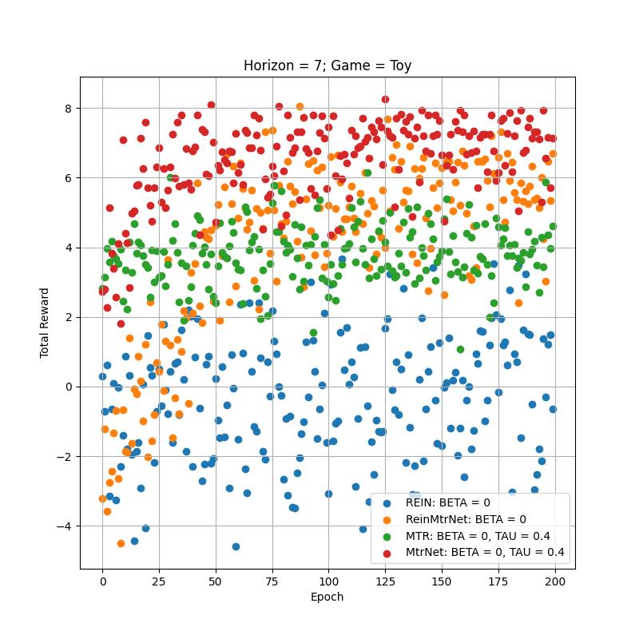

# Matryoshka Algo

**Note:** This project is an implementation of the Matryoshka and "Shared" Matryoshka algorithms with Neural Network policy approximators. As a part of the Master's thesis, it was design to implement the experimental phase in the work ["Neural Horizons: Exploring Matryoshka Policy Gradients"](./documents/Master_project_Medyanikov.pdf) (See section 3.3 Experiments)
 

## Table of Contents
- [Introduction](#introduction)
- [File Structure](#file-structure)
- [Download](#download)
- [Quick start](#quick-start)
- - [main.ipynb](#mainipynb)
- - [Environment settings](#change-environment-settings)
- [Results](#results)
- [To-Do List](#to-do-list)
- [Update 17.10.2023](#update-17102023)
-- [Update 24-10.2023](#update-24102023)
-- [Update 31.10.2023](#update-31102023)

## Introduction

The Matryoshka Algo repository contains two implementations of the Matryoshka algorithm, each differing in the way we contract the approximation function. These implementations are:

1. **Full Connected Neural Network (NN):** In this implementation, we use a fully connected neural network with an extra dimension to encode the step variable. This approach provides quite naive but easy implementation.

2. **Special Case of ResNet NN, named MtrMet:** The second implementation leverages a special case of a Residual Neural Network (ResNet) architecture. This choice offers a different perspective on the algorithm's implementation. Which is closer, to the idea of the original algorithm or what we refer to as "Shred" Matryoshka design.

In addition to the Matryoshka algorithm implementations, we have also included an implementation of the REINFORCE algorithm for comparison purposes. As a result, you will find following classes (Agents) in this repository:

- `ReinforceAgent (REIN)`: This class represents the implementation of the REINFORCE algorithm.
- `MTRAgent (MTR)`: Similar to ReinforceAgent, with extra dimension for input, that used to encode the step horizon and entropy regularized reward.
- `OriginalMtrAgent (Original)`: Parametrization consist of a number of independed blocks, each representing NN with entropy regularization. Each block, encode policy of specific horizon step.
- `MtrNetAgent (MtrNet)`: Our novel design to realize Matroyshka features. (see more Section 3.1 "Shared NN" in ["Neural Horizons: Exploring Matryoshka Policy Gradients"](./documents/Master_project_Medyanikov.pdf))
 

## File Structure

| File/Folder Name | Description |
| ---------------- | ----------- |
| `main.py`        | Main script for initiating the training process. |
| `/models`        | Contains the neural network models used in the policy gradient updates. |
| `/environments`  | Includes the environments simulated for reinforcement learning tasks. |
| `/agents`        | Code for the different reinforcement learning agents. |
| `/utils`         | Utility scripts for tasks like data processing, logging, etc. |
| `/tests`         | Unit tests to validate the functionality of the code. |
| `requirements.txt` | Lists all the Python dependencies required for the project. |
| `/docs`          | Additional documentation and resources. |
| `README.md`      | This file, containing an overview and guide to the repository. |


## Download

To set up this repository on your local machine, follow these steps:

1. Clone the repository:
   ```sh
   git clone https://github.com/Konstantin1231/master_project.git
   
2. Navigate to your Project and Create Virtual environment:
   ```sh
   cd Matryoshka-Algo
   python -m venv venv
3. Activate Virtual environment and install all dependencies:
   ```sh
   venv\Scripts\activate
   pip install -r requirements.txt
   
# Quick start
 
### main.ipynb
Open jupyter notebook main.ipynb.
Select the target environment and run cell. In addition, one can choose to set env.random = True to force the random initializing point.


Next, we set hyperparameters for agents, including learning rate, tau, number of episodes per epoch and number of epochs. By running this cell, we will initialize agents, in other words initialize the Neural Networks, that used to parametrize their policies.


Then, we configure the DataFrame to store results. One can use blank result.csv file for FROM_PATH, and crate new one for TO_PATH = <YOUR PATH>, where all obtained results will be dump in.


Then, one can continue by running the other cells containing training/testing loops for all agents. 
To visualize results, we use RENDER cell, where the only variable to set: agent - agent we want render and agent.tau = the temperature factor during the game.\


### Change environment settings
In order to make more changes, one should explor environment.py file -> game_setup() function.
Where, one can redefine any proposed constants or add new environment.


One can redefine default rewards using environment.py -> custom_reward() function.


### Change Neural Network architecture 
By default, each Neural Network block parametrized by Feed Forward Relu NN with two hidden layers. One, can modify it changing the .Q attribute in SimpleBlock class for each design (Original in original.py, MtrMet in MtrNet.py, REIN in NeuralNet.py).


Make sure, to keep consistency with self.output_layer.


# Agents  


## Update 17.10.2023

### TOY environment 

In recent update, we have added new game environment "Toy".
The object class can be found in the toy.py.
The environment has three variables:
- alphas; List of real numbers, used to construct rewards (Q_1): rewards = dot(alphas, basis ). In addition, the state dimension = len(alphas)
- random_basis; Boolean. When set to the True, will generate random orthonormal basis. By default, we use canonical basis e_1, ...
- one_hot_coded; Boolean. When set to the True, use one hot coded representation of integers. By default, we use integer representation of stats state = 0,1, ...len(alphas)-1

The environment setup could be done in the utils.py (game_setup() function):


In addition, the Toy.render() method, will prepare a plot, that shows the current agent's position, and highlights the next optimal action.


### Matryoshka NET (MTRNet)

New custom ResNet. As we have already mentioned, this implementation offers a different perspective on the algorithm's implementation. Which is closer, to the idea of the original algorithm.
We propose to try two versions (Can be found in MtrNet file):
1. ReinforceMtrNetAgent - Agent that use non-stochastic reward and MTRNet as approximation function.
2. MtrNetAgent - Realize Max-entropy reward, together with MTRNet approximation. (main algorithm)




### Original Matryoshka Algorithm 

The algorithm can be found in original.py file. Whereas, OriginalMtrAgent uses independant approximation function for each pi_i policy. 


## Update 24.10.2023

### General:
 - one_hot_encoded option for Maze environment 
 - fixed crashes, related to the out of range index in early terminated episodes "Cart"/"Pendulum" 
 - MtrNet.forward() now has step parameter as input. And calculate only policies up to "step"
 - .forward() for all NN, now has boolean parameter "softmax", when set to False, forward will output the preference. When set to True, will apply softmax on the output. By default: True
 - MTRNet,now, has an option to set number of parameters per block in decreasing order. By setting "dynamical_layer_param=True" at agent initialization.

### NTK (Neural Tangent Kernel)
Each Agent has ability to call .ntk() method:


By default, ntk do not accept batch inputs. So, one should set batch = True, if input tensors have batch dimensions. 
How it works:
   - horizon_step = horizon - step
   - find parameters theta_horizon_step (parameters used to produce policy for given horizon_step)
   - calculate jacobian (jac) of .forward(x_i, horizon_step, softmax=False) with respect to the theta_horizon_step
   - finally, ntk = jac(x1) @ jac^T(x2)

### Dynamical LR and TAU

In order to get rid-off repetitive code, I have added new "train_agent" function in utils.py. That will launch episodes run and training, and additionally will collect rewards gained after each epoch.


After "patience" number of epochs, we update learning rate and tau according to decay factor:


Remark: To get static tau and lr, set:
 - tau_end = agent.tau
 - lr_end = agent.lr

### ShortLongNet

Short-Long net is an adaptation of the MTRNet, to the environments with high horizon. 
Differently, from MTRNet, we do not associate a NN block with each horizon step. Instead, we associate one bloxk with a group of horizons steps.
At initialization of agent "ShortLongAgent", one should provide:
 *  perc_list = [0.03, 0.06, 0.1, 0.16, 0.26, 0.38, 0.5, 0.65, 0.8] #example
that indicates what is a percentile of horizon is used within different blocks. 
For example, for horizon_step that fall in the interval [0.06, 0.1]*horizon we use block #2. For [0.1, 0.16]*horizon, block #3.

## Update 31.10.2023

### New features for a Toy environment 
#### Q_star/V_star
Now one can generate and store Q_star and V_star values, using bew method: generate_all_q_stars(horizon, step_hor=2, tau=1)
Parameters:
- horizon: usually you want to set one, used during the training
- step-hor: Always starts with 2. (Needed for recurrence )
- tau: usually you want to set one, used during the training \
- output: dictionary .q_star and .v_star
Example


#### New render function
- green circle: the optimal decision based on the optimal policy. Inside circle, we indicate the action value Q_star of the current step horizon.
- red circle: non-optimal choice. As well with the value of the current action value.
- arrow: the decision made by the agent. Green if the decision is the same with an optimal one.
- value inside current state, is a probability of the agent action choice. 

